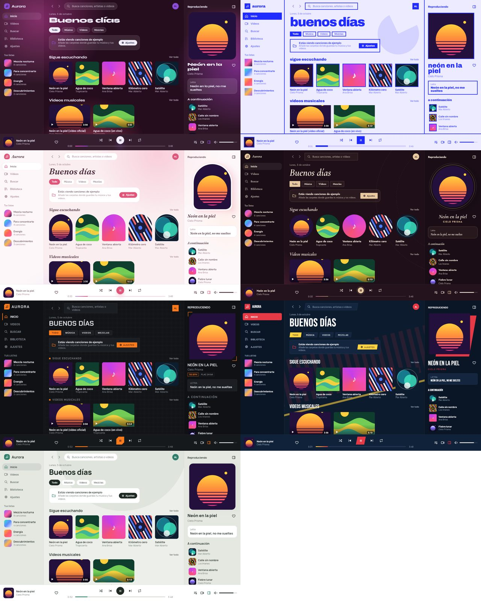
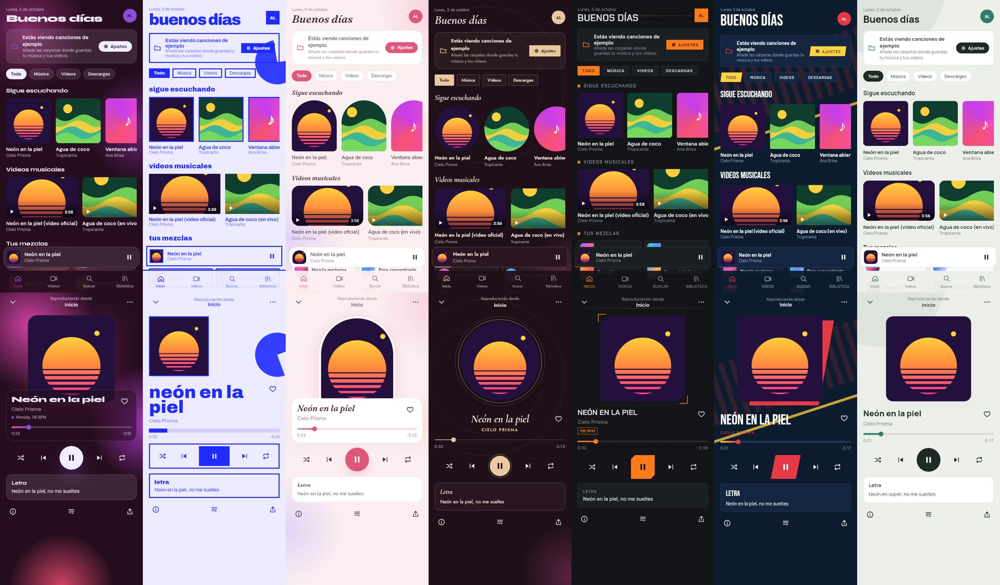

# Aurora

Reproductor de **música y video** de código abierto para **Android, escritorio e iOS**, hecho con
Kotlin Multiplatform y Compose Multiplatform. La interfaz cambia de color con cada canción: la atmósfera
depende del tempo y el color de énfasis sale de la portada.

**Escritorio con tu biblioteca real**


**Los 7 temas** — Aurora, Póster, Pétalo, Seda, Carbono, Estadio y Bruma




> Estado: busca tu música y tus videos en las carpetas que elijas (Ajustes), los reproduce con VLC en escritorio
> (modo cine y pantalla completa), permite crear listas y tiene 7 temas. Audio y video en Android llegan en la próxima fase.


> Ver la hoja de ruta en [ARQUITECTURA.md](ARQUITECTURA.md#10-hoja-de-ruta) y los cambios en [BITACORA.md](BITACORA.md).

## Requisitos

- JDK 21
- Escritorio: **VLC** con sus decodificadores para escuchar y ver videos
  (Arch: `sudo pacman -S vlc vlc-plugin-ffmpeg` · Debian/Ubuntu: `sudo apt install vlc`)
- Android: SDK de Android (Android Studio) — opcional
- iOS: Mac con Xcode — opcional

## Comandos

```sh
./gradlew :composeApp:run            # app de escritorio
./gradlew :composeApp:desktopTest    # pruebas
./gradlew :androidApp:assembleDebug  # APK (si hay SDK de Android)
./gradlew :composeApp:packageDistributionForCurrentOS   # instalador de escritorio
```

Si tienes el SDK de Android, crea `local.properties` con `sdk.dir=/ruta/al/Android/Sdk`
(o define `ANDROID_HOME`) para activar el módulo Android.

## Licencia

[GPL-3.0](LICENSE). Fuentes Syne y DM Sans bajo [SIL Open Font License](docs/licencias/).
