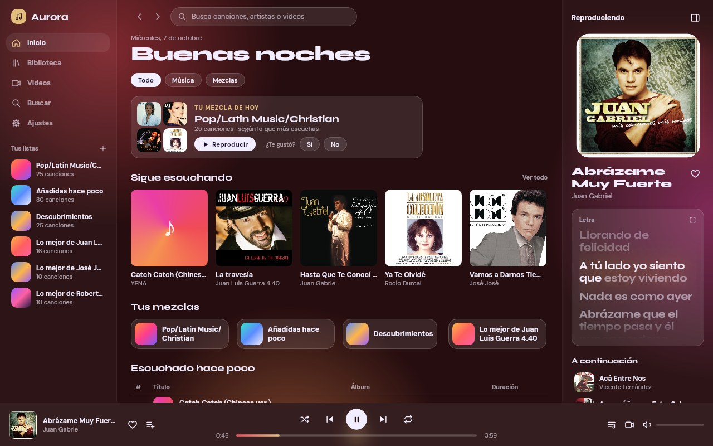
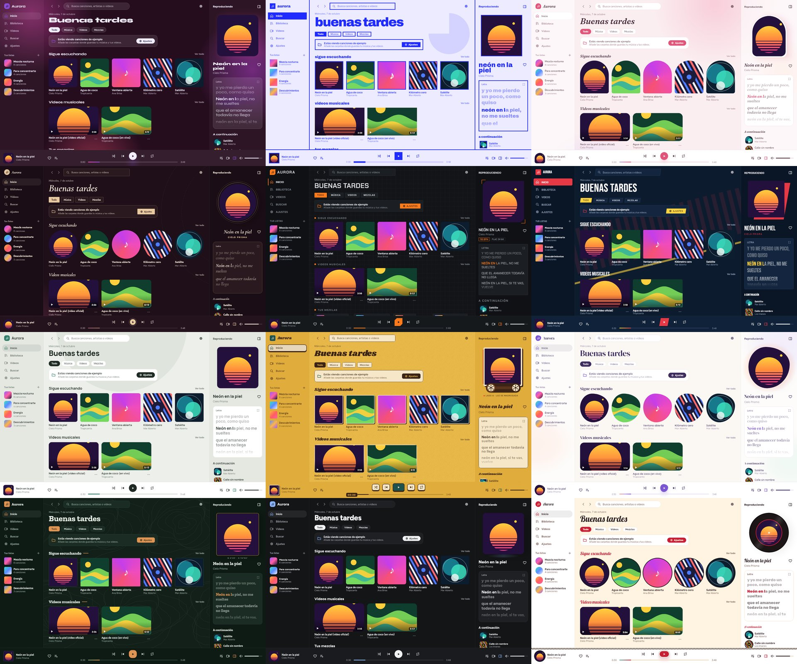
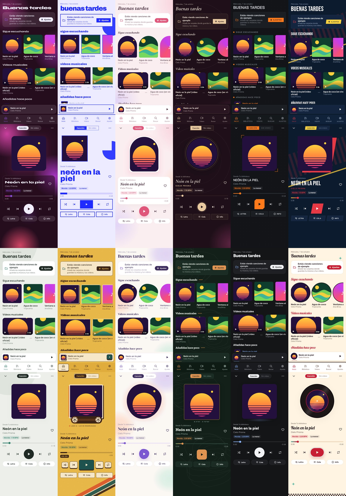
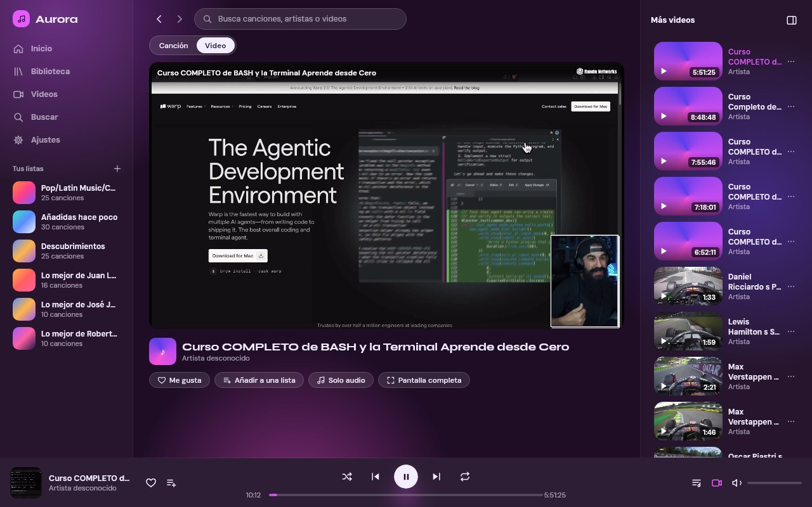

# Aurora

Reproductor de **música y video** de código abierto para **Android, escritorio e iOS**, hecho con
Kotlin Multiplatform y Compose Multiplatform. La interfaz cambia de color con cada canción: la atmósfera
depende del tempo y el color de énfasis sale de la portada.

**Escritorio con tu biblioteca real**



**Los 12 temas** — Aurora, Póster, Pétalo, Seda, Carbono, Estadio, Bruma, Casete, Acuarela, Bosque, Grafito y Rockola




**Tu mezcla de hoy:** cada día, 25 canciones según los géneros y artistas que más escuchas. Si te gusta, se guarda
en tus listas; si no, al día siguiente llega otra.

Cada tema tiene su paleta, sus fuentes, una forma de portada propia y una decoración de fondo: la cinta con
carretes de Casete, la gota de Acuarela, el marco de cobre y las curvas de nivel de Bosque, el vinilo que gira en
Rockola… Las animaciones solo corren mientras suena y se apagan con "Reducir movimiento".

> Estado: busca tu música y tus videos en las carpetas que elijas, los reproduce con VLC en escritorio (modo cine y
> pantalla completa) y con Media3 en Android (notificación, pantalla de bloqueo y 3 widgets), letras sincronizadas,
> listas, ecualizador y 12 temas. Descargas para Android, Windows y Linux en la
> [página de la última versión](https://github.com/lial97/proyecto-aurora-app/releases/latest).

**Modo video**


> Ver la hoja de ruta en [ARQUITECTURA.md](ARQUITECTURA.md#10-hoja-de-ruta) y los cambios en [BITACORA.md](BITACORA.md).

## Requisitos

- JDK 21
- Escritorio: los instaladores ya traen **VLC** adentro. Para `./gradlew :composeApp:run` sin el VLC empaquetado,
  instala VLC con sus decodificadores (Arch: `sudo pacman -S vlc vlc-plugin-ffmpeg` · Debian/Ubuntu: `sudo apt install vlc`)
- Android: SDK de Android (Android Studio) — opcional
- iOS: Mac con Xcode — opcional

## Comandos

```sh
./gradlew :composeApp:run            # app de escritorio
./gradlew :composeApp:desktopTest    # pruebas
./gradlew :androidApp:assembleRelease  # APK optimizado (si hay SDK de Android)
bash scripts/empaquetar-linux.sh      # .deb y AppImage (con Docker), en AURORA-APP/
build-windows.bat                     # instalador .exe de Windows (en Windows, con Java 21)
```

Más detalles en [docs/COMPILAR.md](docs/COMPILAR.md).

Si tienes el SDK de Android, crea `local.properties` con `sdk.dir=/ruta/al/Android/Sdk`
(o define `ANDROID_HOME`) para activar el módulo Android.

## Problemas conocidos

- **Android, Moto G84: los widgets podían trabar la app.** En la 0.3.1 los widgets dibujan menos y nunca hacen fila,
  pero falta confirmarlo en ese teléfono. Si se traba, quita los widgets de Aurora de la pantalla de inicio y
  avísanos. Detalles en [BITACORA.md](BITACORA.md).

## Licencia

[GPL-3.0](LICENSE). Todas las fuentes (Syne, DM Sans, Archivo, Fraunces, Nunito, Cormorant, Jost, Chakra Petch, Inter, Bebas Neue, Barlow, Manrope, Shrikhand, DM Serif Display, Quicksand, Zilla Slab, IBM Plex Sans, Figtree, Lobster y Rubik) son de Google Fonts, bajo la [SIL Open Font License](docs/licencias/).
